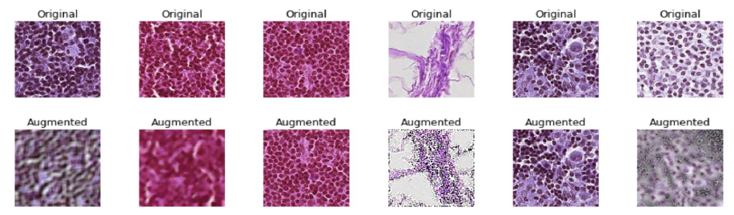
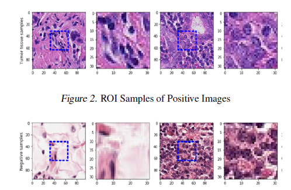

# Breast Cancer Classifications 
This project aims to perform binary classification to detect presence of cancerous cells in histopathological scans. 
The images are taken from the histopathological scans of lymph node sections from Kaggle Histopathological cancer detection challenge and provide tumor visualizations of tumor tissues.

The proposed methods include Deep Learning based approaches to create classifier frameworks which perform end to end data set manipulation, training, test augmentation and detection.Transfer learning using Resnet and Densenet architectures was performed.Specifically, ResNet50, ResNet152 and DenseNet169 models were tried.

We aim to deal with the various discrepancies in the images and the dataset by taking various data pre processing and augmentation
methods. The aim is to perform the classification with high degree of confidence.

These are the histopathological scanned images from the dataset with augmentations.

Following are the pictures of the sample images from the dataset with ROI boundaries for negative and positve tumor samples.

